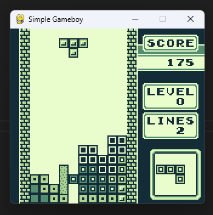

# 🕹️ Python Simple GB Emulator

A simple **Game Boy emulator** written in **pure Python**, made just for fun.  
This project it’s 100% handmade using only **docs**, **Stack Overflow**, and **Google**.  
No Copilot. No GPT. Just some old-fashioned coding fun.

---

## ⚙️ About the Project

This emulator aims to replicate the core functionality of the original **Nintendo Game Boy**, including CPU, memory, and graphics rendering.  
It was created for educational purposes and as a technical challenge to better understand how the Game Boy works internally.

---

## 📚 References

Main documentation and references used:

- [GBZ80 Assembly Reference (rgbds)](https://rgbds.gbdev.io/docs/v0.9.4/gbz80.7)  
- [Pan Docs – Game Boy Technical Reference](https://gbdev.io/pandocs/CPU_Instruction_Set.html)  
- [Boy Emulator (Javascprit reference)](https://github.com/rylev/boy/blob/master/src/cpu)

---

## 🚀 How to Run

To achieve a playable performance, this emulator **must** be executed using **PyPy**, the JIT-compiled Python interpreter.  
Running it with standard Python (CPython) will be significantly slower.

### 1. Install PyPy
Download PyPy from:  
👉 [https://pypy.org/](https://pypy.org/)

### 2. Install pygame-ce using PyPy
```bash
pypy -m ensurepip
pypy -m pip install pygame-ce
````

### 3. Set Your ROM Path

Create a folder named `roms` on root of repository and place your roms on it (do not use spaces on game roms).

Folder structure should look like this:

```bash
|-- python-simple-gb-emulator
    |-- docs
    |-- roms
    |-- emulator
    |-- basic_serial_server.py
    |-- play.py
```

### 4. Run the Emulator

Start the emulator from the command line:

```bash
pypy play.py YOUR_ROM_NAME_WITH_EXTENSION
```

If everything is configured correctly, the emulator window will open and the game will start running.

---

## 🖼️ Screenshots

Below are some screenshots from real gameplay captured in this emulator:

### Pokémon Red


### Tetris



---

## ⚠️ Disclaimer

> It was written purely for experimentation and learning purposes.
> Use it at your own risk.

---

## 🧠 Fun Fact

This emulator was built **entirely by hand** — without AI tools, Copilot, or code generators.
Just classic documentation, debugging, and determination.

---

## 🏁 License

This project is open for study, modification, and experimentation.
Feel free to fork it, improve it, and learn from it — but don’t expect perfection 😄.
